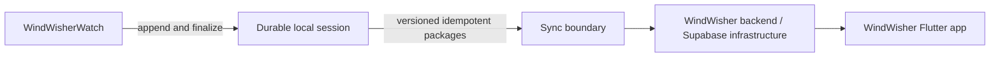
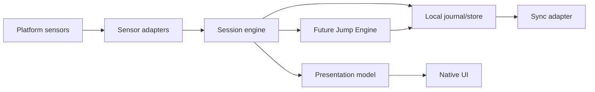

# Architecture

## System context and ownership

The watch owns the durable local recording until the backend acknowledges all packages and the device verifies the receipt. The WindWisher backend then owns the canonical cross-device representation. Publication visibility remains separate. The sync boundary is a protocol; neither contracts nor domain depend on `SupabaseClient`.

## Internal wearable architecture

UI issues commands through the session/application boundary and consumes projections; it never controls sensors or mutates persistence directly. Native adapters map platform data to contract semantics. Garmin uses Monkey C, watchOS Swift/SwiftUI, and Wear OS Kotlin/Compose; no shared UI/runtime is required.

## Domain contracts

JSON Schema Draft 2020-12 defines exchange and persistence semantics for session summaries, jumps, track points, heart rate, devices, forecasts, and sync packages. Schemas use closed objects, explicit units, UTC timestamps, semantic `schemaVersion`, and independent algorithm/sync versions. Schemas are language-neutral validation artifacts, not runtime domain implementations.

## Session and failure model

The minimal recording lifecycle is `prepared -> recording <-> paused -> stopping -> completed`. Recovery may turn an interrupted active state into `recovered`, which must be finalized through `stopping`; irreparable integrity failure becomes `corrupted`. Synchronization is an orthogonal `syncStatus`, avoiding impossible states such as making a recording state simultaneously `syncing`.

An append-only journal with framed records, monotonic sequence, checksums, periodic durable checkpoints, and a completion marker is the baseline design. Recovery scans to the last valid frame, rejects or quarantines the corrupt tail, and never invents samples. Platform stores may differ while preserving these invariants.

## Future Jump Engine

The isolated engine accepts normalized sensor streams plus `DeviceCapabilities`, emits `JumpEvent`, and selects a documented strategy by actual capabilities. Its conceptual pipeline is acquisition input -> timestamp normalization -> preprocessing -> motion classification -> takeoff -> flight -> apex -> landing -> height/airtime/distance estimation -> confidence -> validation. Raw observations remain distinct from derived estimates and metadata.

No universal sensor availability, sample rate, or clock quality is assumed. Algorithm versions are immutable identifiers; recalculation produces a new version/result rather than silently overwriting provenance.

## Sync

A future `SyncPort` transmits bounded `SyncPackage` sequences containing a manifest of summaries, jumps, track chunks, HR chunks, forecast snapshots, and optional diagnostics. `(deviceId, idempotencyKey)` identifies one logical delivery; checksum detects corruption; repeated identical delivery returns the prior outcome. Conflicting content under the same key is rejected. Acknowledgements are per package/sequence, enabling retry and partial recovery.

Compression and transport encryption metadata describe representation; confidentiality relies on standard authenticated transport and platform credential storage, never custom cryptography. Deletion of local data occurs only under an explicit retention policy after verified acknowledgement.

## Security, privacy, and data minimization

GPS, routines, HR, and device identifiers are sensitive. Logs omit payloads and precise coordinates. Tokens stay in platform secure storage and are not contracts. Session visibility defaults to private, and publishing is a separate backend-authorized action. See `SECURITY.md` and `PRIVACY.md`.

## Versioning and extension

- `schemaVersion`: semantic version of a specific contract shape; breaking changes increment major.
- `syncProtocolVersion`: negotiation and delivery behavior, independent of schemas and apps.
- `algorithmVersion`: immutable implementation/configuration identity for a derived result.
- app/platform version: release identity that records which implementations produced data.

Readers reject unsupported major versions, tolerate documented compatible minor evolution only through explicit migrations, and preserve unknown future payloads rather than destructively rewriting them.

## Principal failure modes

Power loss, sensor dropout, clock discontinuity, storage exhaustion, partial write, corrupt frame, unavailable phone/network, duplicate/reordered packages, checksum mismatch, expired credentials, backend conflict, and low-quality algorithm output are explicit outcomes. Recording continues without network; resource exhaustion must warn and fail safely; sync retries never duplicate a session; low confidence suppresses or qualifies metrics.

## Extensibility boundary

New platforms implement adapters and native UI. New sensor strategies consume capability profiles. New contract majors require migrations and fixtures. The current backend is reused unless a future ADR demonstrates a compelling need; no independent backend is planned.
